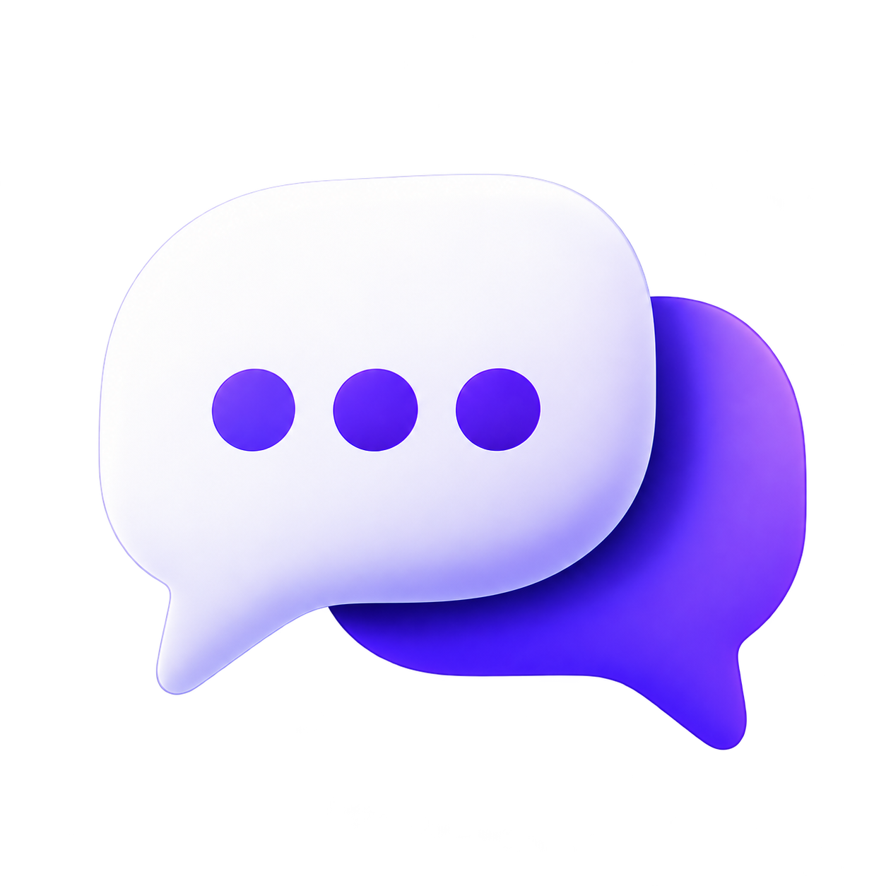
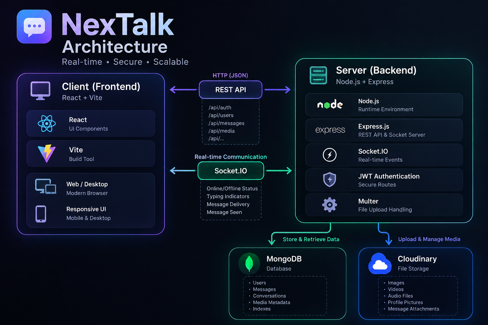

#  NexTalk – Real-Time Messaging Application

NexTalk is a modern real-time messaging application designed for seamless 1-to-1 communication. It provides real-time messaging, media sharing, voice messages, friend management, online presence, notifications, and secure authentication through a clean and responsive interface.

## 🚀 Features

### v1.0.0 — Initial Release

* **Authentication**: Email/Password and Google OAuth authentication.
* **Profiles & Avatars**: Profile editing, bio, gender-based avatars, and custom avatar upload.
* **Real-Time Messaging**: Instant 1-to-1 messaging with Socket.IO.
* **Message Controls**: Reply, forward, edit, delete, pagination, delivered and seen status.
* **Media Sharing**: Images, videos, files, and voice messages.
* **Friend System**: Friend requests, accept/reject, cancel, and unfriend.
* **Privacy**: Block/unblock users and blocklist management.
* **Presence**: Online/offline status, typing indicator, and last seen.
* **Notifications**: Push notifications with per-user mute controls.
* **Chat Search**: Search and manage conversations.
* **Responsive UI**: Desktop, tablet, and mobile support.
* **Theme Support**: Light and dark theme support.

### 🔮 Upcoming Features

* **Group Chat**: Create and participate in group conversations.
* **Message Reactions**: React to messages with emojis and quick reactions.

## 🛠️ Tech Stack

* **Frontend**: React.js, Vite, Tailwind CSS
* **Backend**: Node.js, Express.js
* **Database**: MongoDB / MongoDB Atlas
* **Real-Time**: Socket.IO
* **Authentication**: JWT, bcrypt, Google OAuth
* **Media Storage**: Cloudinary
* **Notifications**: Web Push / VAPID

## 🏗️ Architecture

<p align="center">
  
</p>

## 💾 Installation

### Prerequisites

* Node.js & npm
* MongoDB / MongoDB Atlas
* Cloudinary account
* Google OAuth credentials

### Steps

1. Clone the repository:

```bash
git clone https://github.com/developer-pranav/NexTalk.git
cd NexTalk
```

2. Setup Backend:

```bash
cd server
npm install
```

Create a `.env` file in the server folder and configure the required environment variables.

Run backend:

```bash
npm start
```

3. Setup Frontend:

```bash
cd client
npm install
npm run dev
```

## 📡 Usage

1. Register or continue with Google.
2. Complete your profile.
3. Add friends and start conversations.
4. Send messages, media, and voice messages in real time.
5. Manage chats, notifications, privacy, and profile settings.

## 🔧 Configuration

* Configure MongoDB connection in `.env`.
* Add JWT access and refresh token secrets.
* Configure Cloudinary credentials.
* Configure Google OAuth credentials.
* Configure VAPID keys for push notifications.
* Set the frontend API URL for the deployment environment.


## 🔮 Upcoming Features

* **Group Chat**: Create and participate in group conversations.
* **Message Reactions**: React to messages with emojis and quick reactions.

## 📄 License

This project is licensed under the MIT License - see the [LICENSE](LICENSE.txt) file for details.

## 🤝 Contributing

Want to contribute? Follow these steps:

1. Fork the repository.
2. Create a new branch (`git checkout -b feature/YourFeature`).
3. Commit your changes (`git commit -am 'Add feature'`).
4. Push to the branch (`git push origin feature/YourFeature`).
5. Create a new Pull Request.

We appreciate your contributions!

## 📞 Contact

For any questions or suggestions, please open an issue or contact
[Developer Pranav](mailto:developer.pranav3306@gmail.com)
